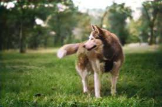

# Pet Colorizer

This application will accept an input grayscale image of a pet (it only can handle dogs and cats for now), and colorize it for you! It was created using the [fastai](https://docs.fast.ai) library, and most of its code actually comes from [Lesson 7](https://course.fast.ai/videos/?lesson=7) of the fastai course. My main contribution has been to change the model introduced in the course from being an image restorer (turning low resolution images to high resolution ones) to an image colorizer. Also, I wrote a python script that encapsulates the whole AI stuff inside and directly converts an input image file into a colorized output image file.

Here are some examples of what this application can do:

<p style="clear: both">


<br/>


<br/>



<br/>


<br/>

## Getting Started

These instructions will get you a copy of the project up and running on your local machine for development and testing purposes. See deployment for notes on how to deploy the project on a live system.

### Prerequisites

Unfortunately, I haven't had the chance to turn this project into a web application yet, due to 

```
Give examples
```

### Installing

A step by step series of examples that tell you how to get a development env running

Say what the step will be

```
Give the example
```

And repeat

```
until finished
```

End with an example of getting some data out of the system or using it for a little demo

## Authors

* **Ahmad Pourihosseini** - [ahmad-PH](https://github.com/ahmad-PH)

## Acknowledgments

* Thanks to all the amazing people at [fast.ai](https://docs.fast.ai/) who have made creating such projects a breeze :)

